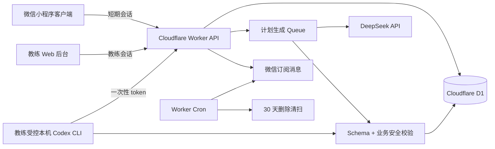

# 轻练 V1 架构与数据合同

状态：规划合同，未进入业务实现  
原则：先闭合一名教练的一名客户，再扩展能力

## 1. 系统边界



当前 mockup 仓库只提供视觉基线；现有页面状态在内存，D1/R2 为空，不能直接视为业务后端。

## 2. 推荐代码表面

```text
apps/
  miniprogram/       # 原生微信小程序，客户端
  coach-web/         # React/Vinext，教练后台
  api/               # Worker routes、auth、jobs、validators
packages/
  contracts/         # DTO、Zod/JSON Schema、错误码
  plan-schema/       # 30 天计划、版本、目录引用
  catalogs/          # 动作/食物种子与版本
db/
  migrations/       # D1/Drizzle migration
scripts/
  codex-plan-fallback.ts
  seed-catalogs.ts
  verify-delete.ts
docs/
  privacy-data-flow.md
  runbooks/codex-fallback.md
```

实现时可在当前 `fit-plan-mockup` 仓库中增量加入这些目录；不要把真实客户数据放入 repo。

## 3. 状态机

### 客户

`invited → onboarding → pending_profile_review → active → frozen → deletion_pending → deleted`

### 生成任务

`queued → running → draft_ready → pending_review → approved/rejected → published`

异常统一进入 `failed`；不能从 `failed` 自动进入 `published`。

### 计划版本

`draft → in_review → published → superseded/archived`

已发布版本不可变。未来调整必须 clone 新草案，设置 `effective_from`，发布时原子关闭旧版本未来区间。过去日期、打卡和反馈不被覆盖。

### 删除

`requested → frozen_30d → purged`

冻结期停止新的模型处理；清扫身份映射、健康档案、未发布草案和 provider 快照。单教练小样本不保留可重识别的 per-user 统计。

## 4. 数据模型

身份和健康数据必须分表、分权限、分 retention；DeepSeek 不接收身份表。

| 表 | 关键字段 | 规则 |
| --- | --- | --- |
| `coach_account` | id、password_hash/status、last_login_at | 单行单账号；无公开注册 |
| `client` | id(ULID)、display_name、status、created_at | 不直接存微信身份明文 |
| `client_auth` | client_id、openid_hash/encrypted、session_hash、expires_at | openid 只服务端；会话短期、轮换 |
| `invitation` | client_id、token_hash、expires_at、consumed_at、revoked_at | 一次性、短期；原 token 不落库 |
| `health_profile` | 结构化目标/指标/训练条件/禁忌/过敏、version、coach_confirmed_at | 应用层 AES-GCM 加密、key version |
| `consent` | client_id、type、text_version、accepted_at、revoked_at | 健康处理、第三方模型、订阅分别记录 |
| `exercise_catalog` | id、name、contraindications、source_version | AI 只能引用 catalog id |
| `food_catalog` | id、name、kcal_per_100g、unit、source_version | kcal 的事实源；服务端计算 |
| `generation_job` | client_id、provider、model、schema_version、status、error_code、trace_id、output_hash | 不保存 raw prompt/completion |
| `plan_draft` | generation_job_id、payload_json、validation_result、review_status | 只对教练可见 |
| `plan_version` | client_id、version_no、effective_from/to、approved_by/at、status、change_reason | 发布后不可变 |
| `plan_day` | plan_version_id、local_date、day_index、title、notes | 固定 `Asia/Shanghai` 业务日 |
| `plan_exercise` | plan_day_id、catalog_id、sets、reps、rest、cues | 与动作库约束比对 |
| `plan_meal` / `plan_food_item` | meal_type、food_catalog_id、grams、derived_kcal、alternatives | kcal 由目录+克数计算 |
| `plan_reminder` | plan_day_id、kind、content | 非诊断、非治疗措辞 |
| `checkin` | client_id、plan_day_id、item_id、status、completed_at | unique 幂等键 |
| `wellness_feedback` | local_date、pain、energy、hunger | pain=present 生成教练告警 |
| `subscription` / `delivery_log` | template_id、consent_at、send_date、provider_code、idempotency_key | 只在明确授权后发送 |
| `audit_event` | actor、action、at、request_id、plan_hash、metadata_redacted | append-only，不含健康原文 |
| `deletion_request` | client_id、requested_at、purge_at、receipt_hash、status | 可追踪但不含健康值 |

所有时间戳使用 UTC；业务日期使用 `YYYY-MM-DD + Asia/Shanghai`。客户端不能通过 ID 选择别人的 client_id，服务端按会话绑定身份。

## 5. API 合同

### 客户端

```text
POST /api/wx/auth/login
POST /api/invitations/accept
GET  /api/me
PUT  /api/me/profile
POST /api/me/consents
GET  /api/plan/today?date=YYYY-MM-DD
GET  /api/plans/calendar?month=YYYY-MM
PUT  /api/checkins                 # 幂等 upsert
PUT  /api/wellness-feedback
POST /api/reminders/subscribe
DELETE /api/me
```

### 教练端

```text
POST /api/coach/session
GET/POST /api/coach/clients
GET/POST /api/coach/invitations
GET/PUT /api/coach/clients/:id/profile
POST /api/coach/clients/:id/profile/confirm
POST /api/coach/clients/:id/plan-generations
GET  /api/coach/generation-jobs/:id
GET/PUT /api/coach/plan-drafts/:id
POST /api/coach/plan-drafts/:id/reject
POST /api/coach/plan-drafts/:id/publish
POST /api/coach/plan-versions/:id/future-copy
GET  /api/coach/clients/:id/checkins
GET  /api/coach/alerts
POST /api/coach/alerts/:id/ack
POST /api/coach/generation-jobs/:id/codex-fallback-token
POST /api/coach/reminders/manual
```

所有 DTO 通过共享 schema 校验；错误返回稳定 `code`，不把 D1 行或 provider 原文直接透传。

## 6. DeepSeek 与 Codex CLI 合同

### DeepSeek

Worker 从 secret/env 读取 `DEEPSEEK_API_URL`、`DEEPSEEK_MODEL`、`DEEPSEEK_API_KEY`。请求只含去身份化结构化 profile 和 catalog；不含姓名、手机号、openid、头像、聊天原文、位置或设备元数据。

计划输出要求：

```json
{
  "schema_version": "plan.v1",
  "timezone": "Asia/Shanghai",
  "start_date": "YYYY-MM-DD",
  "days": [
    {
      "day_index": 1,
      "local_date": "YYYY-MM-DD",
      "exercises": [{"catalog_id":"ex-001","sets":4,"reps":12,"rest_seconds":75}],
      "meals": [{"meal_type":"breakfast","foods":[{"food_catalog_id":"food-001","grams":100}]}],
      "reminders": ["string"]
    }
  ]
}
```

后端双层校验：

1. JSON Schema：30 个本地日期、无重复/缺失日期、字段类型、单位、非负数、禁止额外键。
2. 业务安全：动作 allowlist、伤病/过敏/忌口冲突、餐合计与日合计、异常 kcal、非诊断/非治疗措辞、模型只能引用已发布 catalog。

校验通过前永远是 draft。kcal 不信任模型输出，由 `food_catalog.kcal_per_100g × grams` 计算，并显示营养来源版本。

### Codex CLI fallback

- DeepSeek 超时、5xx、429、空响应、JSON/业务校验失败时只标记 `failed`。
- 教练明确点击后，后台生成一次性短 token 和最小化输入包。
- 受控本机 wrapper 调用 `codex exec`，设置超时、大小和幂等限制。
- CLI 输出必须再次经过同一 schema/业务校验，回传后状态仍是 `pending_review`。
- 不允许服务器自动执行 CLI；不允许客户端看到 draft；不记录 prompt、健康原文或 secret。

## 7. 安全、隐私和运行门禁

- 首次调用前分别记录健康数据同意、第三方模型传输同意、订阅消息同意。
- 隐私说明必须明确“自动化工具/第三方 DeepSeek + 教练审核”；客户端可以不突出 provider 名称，但不能误导成完全人工生成。
- 特殊风险分流人工：未成年人、孕期、急性疼痛、严重慢病、饮食障碍等。
- Web 教练端使用单账号、强密码哈希/锁定；优先 Cloudflare Access。
- CORS、CSRF、邀请/登录/生成/fallback/提醒限流；会话 token 只存 hash。
- 请求日志只含 request_id、状态、耗时和脱敏错误码；不含 openid、健康值、prompt、completion、API key。
- 已发布计划、审核、发布、撤回同意、疼痛告警、删除、提醒回执均 append-only 审计。
- 在 DeepSeek 数据驻留、保留、训练使用、跨境和微信审核条件核验前，真实健康数据状态为 `blocked/unknown`，只能用假数据。

## 8. 测试与运行验收

- 纯单测：schema、日期连续性、时区、目录/kcal、版本生效区间、幂等键。
- provider 测试：成功、超时、429、5xx、空响应、非法 JSON、缺日、重复日、过敏冲突、异常 kcal。
- 权限测试：客户越权读写、过期邀请、过期 fallback token、重复导入。
- 版本测试：未来版本不覆盖过去日期；发布失败旧版本继续可见。
- 运行测试：提醒授权与送达回执、疼痛告警、删除 30 天清扫与恢复演练。
- 安全门：gitleaks、secret scan、日志检查、无原始健康 payload 泄漏。

